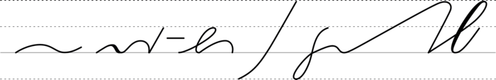

## background

Wikimedia currently contains 39349 symbolizations about the first degree
of simplification of Deutsche Einheitskurzschrift (DEK) which is known
as Verkehrsschrift. The symbolizations are originally created by user
[Thirunavukkarasye-Raveendran](https://commons.wikimedia.org/wiki/User:Thirunavukkarasye-Raveendran)
(who is not author of this repository) as "ineligible for copyright and
therefore in the public domain because it consists entirely of
information that is common property and contains no original authorship"
([example
page](https://commons.wikimedia.org/wiki/File:DEK_Deutsche_Einheitskurzschrift_-_Verkehrsschrift_-_Urheber.svg),
so far last consultation on \<2023-06-30 Fri\>). This project aims to
compile a large sub set as bidirectional flash cards to facilitate
selfstudy, i.e. to provide a handy reference of how to symbolize long
hand in short hand, as well as the reading of short hand in one spot.

Within an Anki deck, flash cards can carry varying tags. Running a
`customary study` in an Anki session, this then allows the interested to
draw only cards of one sub topic from one deck for a focused revision.
The programmatic assignment of tags is inspired by a presentation by
Moritz Gnisia ([first
part](https://gnisitricks.de/de/2018/09/Automatisch-Karteikarten-erstellen-Teil-1/),
[second
part](https://gnisitricks.de/de/2020/05/Automatisch-Karteikarten-Teil-2/)).

So far, only a small fraction of about 10% are indexed with a different
tag than `DEK`, which is the default. The sets available are:

|   set | entries | Symbolisierungen thematisieren / symbolizations are about               |
|------:|--------:|-------------------------------------------------------------------------|
| A_DEK |     182 | Abkürzungen / abbreviations                                             |
| B_DEK |     531 | Symbolisierung mit zwei Worten / two word symbolizations                |
| C_DEK |     171 | Symbolisierung mit drei Worten / three word symbolizations              |
|   DEK |   34377 | (noch) nicht indizierter Grundeintrag / not (yet) indexed symbolization |
| E_DEK |     139 | Englisch / symbolization of English words                               |
| F_DEK |     120 | falsche Symbolisierung / erroneous symbolizations                       |
| G_DEK |     837 | geographische Beispiele / terms of geography                            |
| K_DEK |     280 | Beispiele zu Kürzeln / examples how to use Kuerzel                      |
| L_DEK |      55 | lateinische Begriffe / terms related to Latin                           |
| N_DEK |      48 | nicht empfohlene Symbolisierungen / not recommended symbolizations      |
| O_DEK |      31 | Organizationen, Marken / organizations, trade marks (e.g., UNO)         |
| P_DEK |     563 | Namen und Personen / names and historic personalities                   |
| U_DEK |     195 | Unterscheidungszeichen / use of special signs in symbolizations         |
| V_DEK |     381 | vergleichende Gegenüberstellungen / contrasting comparisons             |
| Z_DEK |     208 | kurze Sätze und Sprichworte / short phrases and proverbs                |
| total |   38118 |                                                                         |

About 5% of the symbolizations available on Wikimedia's servers are
perceived to be not (yet) suitable for an inclusion in this Anki deck.
For many of them, their dimension / scaling of representation differs
(too) much in comparison to the examples compiled here; this however
contradicts the aim to provide a consistent visual appeal within this
Anki deck.

To obtain a deck still (reasonably) portable, the files about individual
symbolizations were simplified with
[svgcleaner](https://github.com/RazrFalcon/svgcleaner). This reduced the
initial global file size (approx. 340 MB) of the raw data to about 30 MB
(the `.apkg` Anki package you should download directly from the [release
page](https://github.com/nbehrnd/DEK_VS_svg/releases) as an asset), or
about 50 MB within Anki's folder `collection.media` after the import
into the program.
